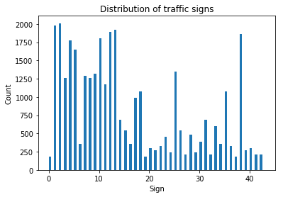
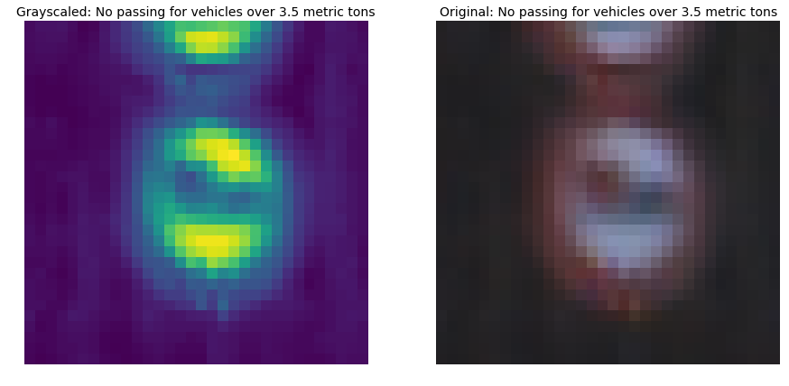

# **Traffic Sign Recognition** 

---

**[Build a Traffic Sign Recognition Project](https://github.com/baocongchen/CarND-Traffic-Sign-Classifier-Project/blob/master/Traffic_Sign_Classifier.ipynb)**

In this document, I will show the details of what I do in this project step by step:

* Load the data set (see below for links to the project data set)
* Explore, summarize and visualize the data set
* Design, train and test a model architecture
* Use the model to make predictions on new images
* Analyze the softmax probabilities of the new images
* Summarize the results with a written report

## Rubric Points
### Here I will consider the [rubric points](https://review.udacity.com/#!/rubrics/481/view) individually and describe how I addressed each point in my implementation.  

---
### Writeup / README

Here is a link to my [project code](https://github.com/baocongchen/CarND-Traffic-Sign-Classifier-Project/blob/master/Traffic_Sign_Classifier.ipynb)

### Load The Data

Training data, validation data, and test data are loaded and assigned to feature and label variables.

### Data Set Summary & Exploration

I used python built-in functions to calculate summary statistics of the traffic signs data set:

* The size of training set is 34799
* The size of test set is 12623
* The shape of a traffic sign image is (32, 32, 3)
* The number of unique classes/labels in the data set is 43

Here is a plot of the 43 unique traffic signs that represent 43 types of traffic signs in the dataset. 

Here is an exploratory visualization of the data set. It is a histogram that shows the distribution of the traffic dataset. Sign 1 and 2 each has around 2000 records whereas sign 0 and sign 19 each only has around 200 records; some form of data augmentation could be necessary to improve classification accuracy; however I choose not to implement it at this point.

### Design and Test a Model Architecture

As a first step, I decided to rescale the data by using `skimage`'s function `exposure.rescale_intensity`; this returns an image with value that ranges between -0.5 and 0.5 after stretching or shrinking its intensity levels. 

Then, I converted the image to grayscale using `skimage`'s function `color.rgb2gray` because color doesn't help us identify important edges or other features; it can also be noise, thus makes it harder to classify objects. Before I decided to use grayscale, I had tried keeping 3 channel-colors but the accuracy on validation set lingered around 92%. With grayscale technique, I improved the validation accuracy by 2~3%.

My final model consisted of the following layers:

| Layer         		|     Description	        					| 
|:---------------------:|:---------------------------------------------:| 
| Input         		| 32x32x1 image   							| 
| Convolution 5x5     	| 1x1 stride, same padding, outputs 32x32x25 	|
| RELU					|												|
| Dropout | 80% of neuron's output is kept during dropout |
| Convolution 5x5	    | 1x1 stride, same padding, outputs 32x32x25 		|
| RELU					|	
| Max pooling	2x2      	| 2x2 stride,  outputs 16x16x50 				|
| Dropout | 80% of neuron's output is kept during dropout |
| Fully connected		|       									|
| Dropout | 75% of neuron's output is kept during dropout |
| Fully connected		|       									|
| Dropout | 75% of neuron's output is kept during dropout |
| Softmax				|    									|

There is a variety of optimization algorithms but I choose to train the model with Adam algorithm which combines the advantages of  
- AdaGrad: works well with sparse gradients
- RMSProp: works well in non-stationary settings

I used batch size of 50. Having experimented with batches ranging from 43 to 512, I found out that those between 43 and 60 yielded the best accuracy. I intuitively think that putting a lot of information to learn at a time can be difficult for machine as it is for human beings. The number of classes can also be a factor to consider when choosing batch size. Generally, the batch size should not be smaller than the number of classes. 

I used 20 epochs to train the network. The system was optimized so that it does not take many epochs to exceed 93% validation accuracy. Increasing the number of epochs to 100 may help improve the accuracy of my model by 2% but it could lead to over-fitting.

I used a learning rate of 0.001. I had tried several other rates ranging from 0.01 to 0.0001. The network learns almost nothing when learning rate is too high. For instance, with a rate of 0.01, my model always returns 5% accuracy; while a rate of 0.0001 makes it stuck in the local optima of 92% accuracy. 

I used `tf.truncated_normal` to initialize weights with a mean of 0 and a standard deviation of 0.075; for biases I just used `tf.zeros` to set them all to 0. Randomizing weights with these hyperparameter's values will optimize the speed of learning.

My final model results were: 

* Validation set accuracy of 94.3% 
* **Test set accuracy of 94.4%**
* New test set accuracy of 40%

I tried many different architectures and evaluated their performances; this includes combinations of different number of convolutional layers and fully connected layers. My first architecture included two convolutional layers, two fully connected layers, and an output layer. I got validation set accuracy between 5% ~ 96%. However the one that yielded the highest accuracy (96%) on validation set performed poorly on the test set (93%) and the new test set (20%). I applied maxpool to the last hidden layer to keep only relevant features. As I tried maxpool on the first and second layers, and looked at the images generated by function `outputFeatureMap`, I found out some entirely black images which indicated that some of the neurons were dead, and validation accuracy lingered around 91%. Therefore, I decided to use maxpool only in the last hidden layer and adjusted the number of filters in each layer. To avoid over-fitting, I applied dropout in the hidden layers and fully connected layers. In the first architecture, I used dropout only in the fully connected layers, thus the test accuracy were often 2~3% lower than the validation accuracy. 

###Test a Model on New Images

Here are ten German traffic signs that I found on the web:

The second image "Speed Limit (70km/h)", the eighth image "Wild animal crossing",  and the nineth image may be difficult to classify: two of them are small and the other has 2 signs which is confusing.

Here are the results of the prediction:

| Image			                    |     Prediction	        					           | 
|:-----------------------------:|:--------------------------------------------:| 
| Speed limit (30km/h)      		|    Speed limit (30km/h)  							       | 
| Speed limit (70km/h)     			|    No entry 								                 |
| General caution					      |    Speed limit (30km/h)								       | 
| Pedestrians	      		        |    Speed limit (80km/h) 			 				       |
| Stop			                    |    Yield   							                     |
| Children crossing      		    |    Speed limit (60km/h)								       | 
| Road narrows on the right     |    Road narrows on the right	               |
| Wild animals crossing					|    Stop	  								                   |
| Priority road/Go straight or right    | Road narrows on the right 	         |
| Speed limit (20km/h)			    | Speed limit (80km/h)      						       |

The model was able to correctly guess 2 of the 10 traffic signs, which gives an accuracy of 20%. The result indicates that the model can not generalize to a wide range of traffic sign data which include mutiple signs in an image, signs with words, signs that are small...etc  

For the first image, the model is absolutely sure that this is a "Speed limit (30km/h)" sign (probability of 1.0), and the image does contain a "Speed limit (30km/h)" sign. The top soft max probabilities was

| Probability         	|     Prediction	        					            | 
|:---------------------:|:---------------------------------------------:| 
| 100%        			    |    			Speed limit (30km/h)						      | 
 

For the second image, the model failed to classify the right traffic sign. The traffic sign Speed limit (70km/h) is very different from No entry sign; however, the model is very sure that the image contains No entry sign. The size of the traffic sign is small when compared to the total size of the image, thus leads to the error.

|  Probability        	|     Prediction        					              | 
|:---------------------:|:---------------------------------------------:| 
|    91.282421%      		|    	No entry 								                  | 
|     2.9595% 				  | 		Double curve								              |
|   	2.838953%				  | 	Beware of ice/snow									        |
|   	2.158341%      		|   	Priority road 				 				            |
|   	0.367777%			    |    Yield   							                      |

For the third image, the traffic sign is correctly classified as 
General caution

|    Probability      	|     Prediction        					              | 
|:---------------------:|:---------------------------------------------:| 
|     100.0% 		        |    		General caution							| 

For the fourth image, the model failed to classify the image. There seems to be nothing in common between "General caution" and "Pedestrian" signs. 

|    Probability      	|     Prediction        					            | 
|:---------------------:|:---------------------------------------------:| 
|   99.994123% 			    |   General caution 									| 
|   0.004412% 		      | 	Go straight or right									|
|   0.001441% 		      | 	Speed limit (80km/h)									|
|   2.6e-05%     			  |   Speed limit (70km/h)					 				|

For the fifth image, the Stop sign was classified incorrectly as Speed limit (80km/h). Again, there's almost nothing in common between the two signs.  

|    Probability      	|     Prediction        					            | 
|:---------------------:|:---------------------------------------------:| 
|  99.994922%          	|  Speed limit (80km/h)  									| 
|  0.005005%      			| 	End of speed limit (80km/h)									|
|  5.1e-05%    					| 		Speed limit (60km/h)								|
|  1.8e-05%  	      		|   Speed limit (50km/h) 					 				|
|  5e-06%  				      |  Stop     							|

For the sixth image, the sign children crossing is classified as road work. The two sign both have the same shape and include human.

|    Probability      	|    Prediction         					            | 
|:---------------------:|:---------------------------------------------:| 
|   82.099819%         	|   Road work 									| 
|   16.684569%    			| 	Speed limit (60km/h)									|
|    1.189671% 					| 	Turn right ahead									|
|   0.021288%      			|   		Speed limit (80km/h) 	 			 				|
|   0.00374% 			      |       Right-of-way at the next intersection		|

For the seventh image, the sign is classified correctly. The model does very well for this traffic sign. We see that the size of the traffic sign is alwost the same as the size of the image, thus makes it easy for the model to classfy it correctly. 

|    Probability      	|      Prediction       					            | 
|:---------------------:|:---------------------------------------------:| 
|    100.0%        			|    	Road narrows on the right								| 

For the eighth image, the sign Wild animal crossing is small. Again, the model finds it hard to classify image of this size. 

|    Probability      	|     Prediction        					            | 
|:---------------------:|:---------------------------------------------:| 
|    99.999738%   			|     No entry										|
|    0.000264%  				| 	  Keep right									|
|    3e-06%  	      		|   	End of all speed and passing limits			|

For the nineth image, two traffic signs are stacked together. The model failed to classify the image. We need to split image like this into different parts so as to make it easy to classify the image 

|    Probability      	|     Prediction        					            | 
|:---------------------:|:---------------------------------------------:| 
|  92.254335%         	|   Yield 									| 
|  3.334972%    				| 	Keep left 									|
|  2.094369% 					  |   Go straight or right									|
|  0.619303%  	      	|   Bumpy road  					 				|
|  0.443438%   				  |   Turn left ahead      							|

For the tenth image, we see the classical error. This happens whenever the proportion of the size of a traffic sign to the size of the image is small. The closer it is to 1 the more easily the model can classify an image. 

|    Probability      	|     Prediction        					            | 
|:---------------------:|:---------------------------------------------:| 
|     85.755736%        |  Stop  									| 
|     14.244235%        |  Speed limit (80km/h)									|
|   	3.3e-05%          |  General caution										|

We conclude that data preprocessing techniques should be improved to classify new test images. Built-in radars should be able to detect traffic signs one by one, and ONLY capture image of traffic signs and truncate part of the image that does not contain traffic signs. Success in doing so will help improve the quality of data, thus boost classification accuracy.